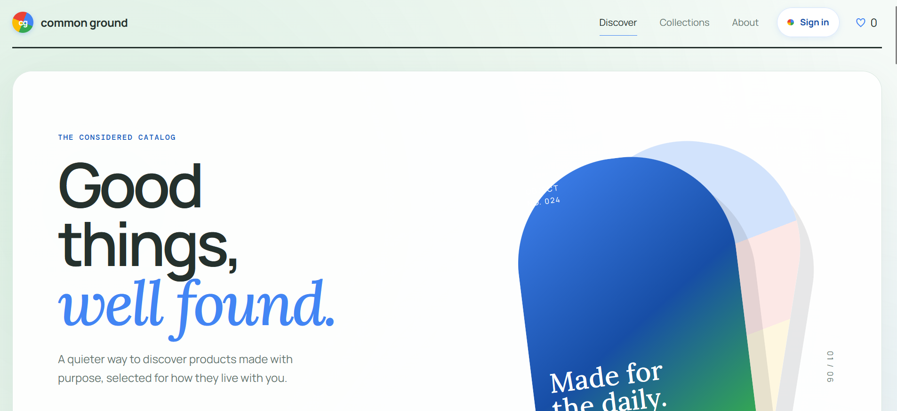
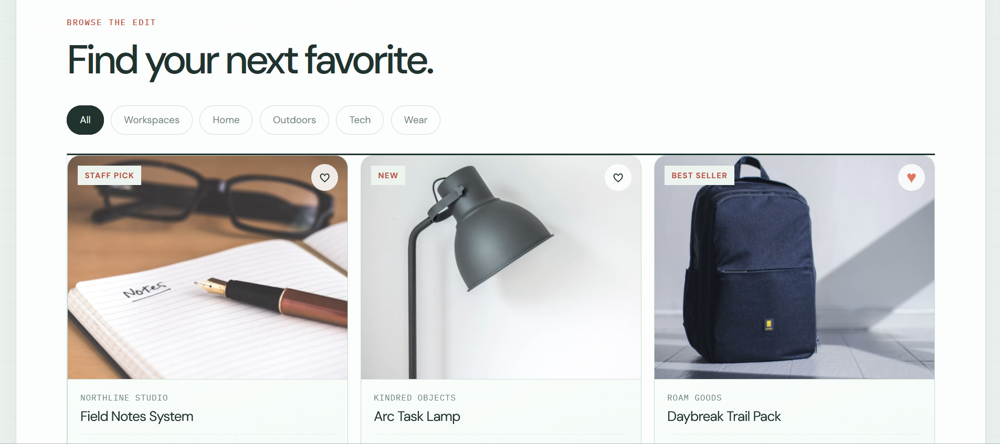

# Application Build

Common Ground is a full-stack product discovery experience: a calm, searchable catalog for finding well-made products across home, workspaces, tech, outdoors, and wear. It is powered by a Node.js + Express API and includes a production-oriented security baseline: secure transport, hardened sessions, CSRF protection, rate limiting, strict validation, bcrypt-backed authentication, bounded streaming, safe errors, and protected metrics.



## What the application does

- Serves a responsive product discovery experience with search, categories, saved items, and product detail views
- Starts an Express API on HTTPS and redirects HTTP traffic to HTTPS
- Exposes catalog, example, and protected routes for demonstration and testing
- Uses Helmet, CSRF middleware, session cookies, and input validation
- Tracks request metrics and exposes them on `/metrics` only with a bearer token
- Uses environment-backed authentication and centralized authorization

## Prerequisites

- Node.js 20+
- npm

## Run locally

From the project root:

```bash
npm install
npm run dev
```

Then open:

- http://localhost:8080
- https://localhost:3443

The app uses a self-signed certificate stored in the `certificates` folder for local HTTPS testing. If the certificate files are missing, the server generates them automatically in development. Production requires managed TLS certificate files and fails closed when they are missing.

## Useful commands

```bash
npm run build
npm test
npm start
```

## Example requests

- `GET /` — welcome response
- `GET /healthz` — minimal public health response with no internal counters
- `GET /api/csrf-token` — CSRF token for browser clients
- `GET /api/example?name=Alice` — validation example
- `GET /api/protected` — requires basic auth
- `GET /api/diagnostics` — authenticated operational feed with uptime, request counts, active connections, and bounded recent events
- `GET /api/diagnostics/feed` — authenticated live Server-Sent Events maintenance feed; capped and heartbeat-protected
- `GET /metrics` — Prometheus metrics; requires `Authorization: Bearer $METRICS_TOKEN`

## Authentication configuration

Protected endpoints do not contain default passwords. Generate bcrypt hashes and provide them through environment variables:

```bash
node -e "console.log(require('bcryptjs').hashSync(process.argv[1], 12))" 'use-a-local-password'
```

Set the resulting value as `USER_PASSWORD_HASH` for the protected API.

## Environment configuration

Create a `.env` file if you want to override defaults:

```bash
SESSION_SECRET=replace-with-at-least-32-random-characters
USER_USERNAME=user
USER_PASSWORD_HASH=replace-with-bcrypt-hash
METRICS_TOKEN=replace-with-a-long-random-token
MAX_REQUEST_BYTES=100000
MAX_DIAGNOSTIC_SUBSCRIBERS=10
DATA_DIR=./data
PORT=8080
HTTPS_PORT=3443
PUBLIC_ORIGIN=https://localhost:3443
NODE_ENV=development
```

## Notes

For production, use a managed identity provider or a durable user store, a persistent session store instead of the default in-memory store, managed TLS, centralized secrets, dependency scanning, and a process manager or container platform. The application intentionally fails closed when `SESSION_SECRET` or production TLS configuration is missing.

For multi-instance or industrial deployment, add a Redis-backed session and rate-limit store through `REDIS_URL`, place replicas behind a load balancer, serve product media through object storage/CDN, and route logs and metrics to centralized observability. The application now reports readiness through `/healthz` and drains active HTTP connections and diagnostic subscribers during shutdown.

The catalog API uses short-lived cache headers and the browser cancels stale searches. Production should place a CDN or shared cache in front of `/assets` and `/api/products`; the current in-process catalog is optimized for the prototype but is not a replacement for a database-backed product index at large scale.

Anti-cloning protections are intentionally transparent: API responses are marked `noindex`, crawler guidance excludes operational endpoints, catalog requests have a dedicated abuse limit, and ownership is stated in the site footer. Browser-delivered assets remain inspectable by design; proprietary business rules must stay server-side.
